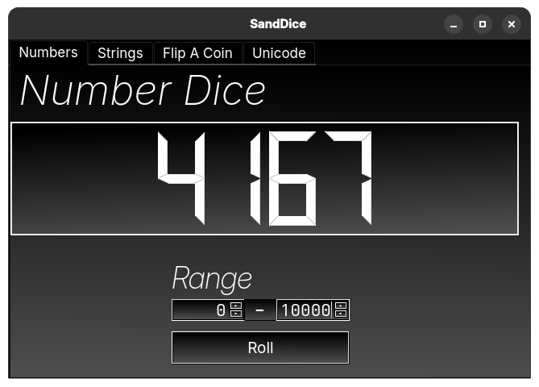

# sanddice
A simple dice app, themed after eyemint (my design language)
## Screenshots

## Installation
Run the install.sh script or run the following in the terminal

`sudo curl [thing] | sudo bash`

The install script will have to be run as root because it places files into the /usr directory
## Building
`pip install pyqt6`

`pyinstaller --onefile sanddice.py`

Then place the files in the correct places:
sanddice.png in `/usr/share/sandpotnoodles/sanddice.png`
sanddice.desktop in `/usr/share/sandpotnoodles/sanddice.desktop`

## Usage
You'll 100% figure it out, trust me